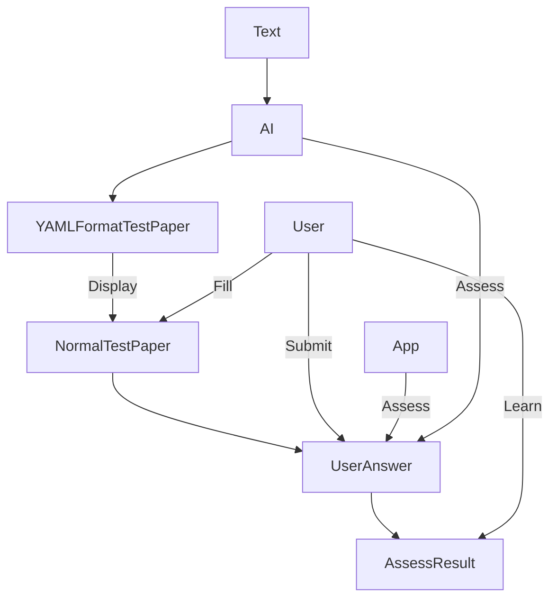

# aIQ: AI-assisted Quizzer

At the top layer, in the end user's eye, the app provide this functionality:

- Generate a test paper from the text the user provides.
- Assess the user's answer to the test paper.
- Help the user to get better score at the test paper.

A more technical view of how this is done:



A more detailed description of the functionality:

Generate an hash for each questions text as the questions's id, and generate a hash for the yaml file as the test paper's id.

- Assess the user's answer to the test paper.
- Help the user to get better score at the test paper.
  - Weak-point removal.
      - Remember the user's performance at each question.
      - Find out the user's weak points based on the performance.
      - Generate a new test paper based on the user's weak points.

## Prompt for AI

- Generate a test paper from the text the user provides.
  - The test paper should test the user's understanding of the text comprehensively.
  - Use Bloom's taxonomy to design questions.
  - The total score of the test paper is 100.
  - Question types:
    - Single choice.
      - Each single choice question has 4 choices.
      - Only one choice is correct.
      - Each single choice question has a score of 2.5.
      - There is a total of 10 single choice questions.
    - Multiple choice.
      - Each multiple choice question has 4 choices.
      - One to four choices are possibly correct. But at least one choice is correct.
      - Each multiple choice question has a score of 4.
      - There is a total of 5 multiple choice questions.
    - True or false.
      - Each true or false question has a score of 2.5.
      - There is a total of 10 true or false questions.
    - Fill in the blank.
      - Each fill in the blank question has a score of 2.5.
      - There is a total of 4 fill in the blank questions.
    - Short answer.
      - Each short answer question has a score of 10.
      - There is a total of 3 short answer question.
      - To answer each short answer questions, the user should be able to analysis the text, deeply.
  - The test paper should be done in 50 minutes, provided the user has understand the text.

This table summarizes the requirements of questions:

| Question type     | Number of questions | Score per question | Total score |
| ----------------- | ------------------- | ------------------ | ----------- |
| Single choice     | 10                  | 2.5                | 25          |
| Multiple choice   | 5                   | 4                  | 20          |
| True or false     | 10                  | 2.5                | 25          |
| Fill in the blank | 4                   | 2.5                | 10          |
| Short answer      | 3                   | 10                 | 30          |
| Total             | 32                  | /                  | 100         |

The YAML format of the test paper is the following:

(There is no explanation field for the short_answer questions, since the answer itself is an explanation already)

```yaml
title: [the title of the test paper]
description: [a short description about what this paper tests]
single_choice:
  - question: What is the name of the anime genre that features cute girls doing cute things?
    options:
      - A) Shoujo
      - B) Yuri
      - C) Isekai
      - D) Slice of Life
    answer: D) Slice of Life
    answer_idx: 3
    explanation: [Explain why this is the correct answer]
multiple_choice:
  - question: Which of the following anime are based on light novels?
    options:
      - A) Sword Art Online
      - B) Death Note
      - C) Re:Zero
      - D) One Piece
    answer: 
      - A) Sword Art Online
      - C) Re:Zero
    answer_idx: 
      - 0
      - 2
    explanation: [Explain why this is the correct answer]
true_false:
  - question: The anime Fullmetal Alchemist is based on a manga by Hiromu Arakawa.
    answer: True
    explanation: [Explain why this is the correct answer]
fill_blank:
 - question: NAT-enabled routers use a NAT translation table to store mappings between $0 and $1.
    answer:
      - private IP addresses
      - public IP addresses
    explanation: NAT-enabled routers use a NAT translation table to store mappings between private IP addresses and public IP addresses.
short_answer:
  - question: What is the main theme of the anime series Death Note and how does it relate to the characters of Light Yagami and L?
    answer: The main theme of Death Note is the moral ambiguity of justice and how different people have different views on what is right and wrong. Light Yagami believes that he is doing justice by killing criminals with the Death Note, a supernatural notebook that can kill anyone whose name is written in it. He sees himself as a god who can create a new world order. L, on the other hand, is a genius detective who opposes Light and tries to catch him. He believes that Light is a mass murderer who has no right to judge others and that his actions are evil. The anime series explores the psychological and philosophical conflict between these two characters and their respective ideals of justice.
```

That being said, this message is already too long.
So, I'll provide the text in next message. When you received the text, send me title and description only.
Considering that the entire test paper is also too long, after the output of title and description, you should just output what I required.
(So that we can also have gaps to discuss the generated questions).
When I send the message: single_choice, you should only output single_choice section.
When I send the message: multiple_choice, you should only output multiple_choice section.
And so on.
Then I'll ask for other sections.
Any YAML in your reply should be inside markdown code block like this:
```yaml
your yaml code
```
If you understand my request, please reply I understand.

## A typical use scenario

The user opens the app, the app shows a welcome screen that consists of:
- A button to start a new test.
- A list of test papers the user has taken before.
- Maybe a statistics of the user's performance.

The user could choose to do:
- Redo a test paper the user has taken before.
- Create a new test.
- 

## Examples of generated test paper


| Example                                                    | Generator                      | Text Source                             |
| ---------------------------------------------------------- | ------------------------------ | --------------------------------------- |
| [./doc/example_chatgpt.yaml](./doc/example_chatgpt.yaml)   | [ChatGPT 3.5](chat.openai.com) | 4.3.3 Network Address Translation (NAT) |
| [./doc/example_bingchat.yaml](./doc/example_bingchat.yaml) | [Bing Chat](bing.com/chat)     | 4.3.3 Network Address Translation (NAT) |


I will say that bing chat is better, but a lot annoying, since the character limit is 4000.
If you have access to OpenAI's ChatGPT 4, you should used it instead of ChatGPT 3.5.