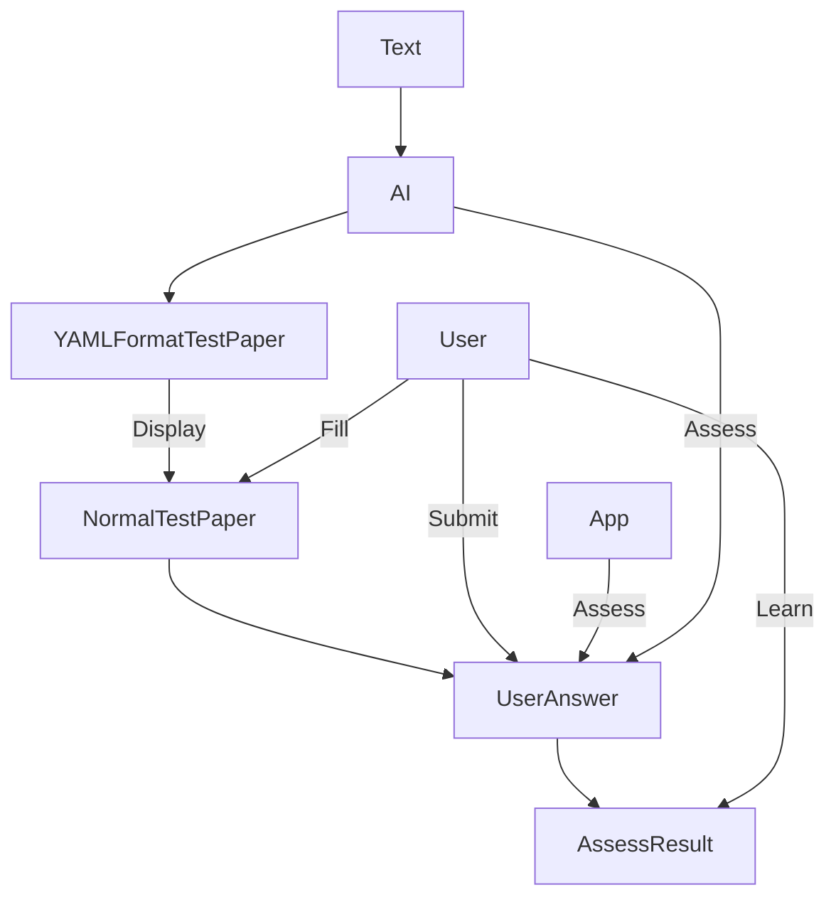

# aIQ: AI-assisted Quizzer

At the top layer, in the end user's eye, the app provide this functionality:

- Generate a test paper from the text the user provides.
- Assess the user's answer to the test paper.
- Help the user to get better score at the test paper.

A more technical view of how this is done:

A more detailed description of the functionality:

- Generate a test paper from the text the user provides.
  - The test paper should test the user's understanding of the text comprehensively.
  - Use Bloom's taxonomy to design questions.
  - The total score of the test paper is 100.
  - Question types:
    - Single choice.
      - Each single choice question has 4 choices.
      - Only one choice is correct.
      - Each single choice question has a score of 2.5.
      - There is a total of 10 single choice questions.
    - Multiple choice.
      - Each multiple choice question has 4 choices.
      - One to four choices are possibly correct. But at least one choice is correct.
      - Each multiple choice question has a score of 4.
      - There is a total of 5 multiple choice questions.
    - True or false.
      - Each true or false question has a score of 2.5.
      - There is a total of 10 true or false questions.
    - Fill in the blank.
      - Each fill in the blank question has a score of 2.5.
      - There is a total of 4 fill in the blank questions.
    - Short answer.
      - Each short answer question has a score of 10.
      - There is a total of 3 short answer question.
  - The test paper should be done in 50 minutes, provided the user has understand the text.
  - The YAML format is the following:

| Question type     | Number of questions | Score per question | Total score |
| ----------------- | ------------------- | ------------------ | ----------- |
| Single choice     | 10                  | 2.5                | 25          |
| Multiple choice   | 5                   | 4                  | 20          |
| True or false     | 10                  | 2.5                | 25          |
| Fill in the blank | 4                   | 2.5                | 10          |
| Short answer      | 3                   | 10                 | 30          |
| Total             | 32                  | /                  | 100         |

Generate an hash for each questions text as the questions's id, and generate a hash for the yaml file as the test paper's id.

- Assess the user's answer to the test paper.
- Help the user to get better score at the test paper.
  - Weak-point removal.
      - Remember the user's performance at each question.
      - Find out the user's weak points based on the performance.
      - Generate a new test paper based on the user's weak points.

## A typical use scenario

The user opens the app, the app shows a welcome screen that consists of:
- A button to start a new test.
- A list of test papers the user has taken before.
- Maybe a statistics of the user's performance.

The user could choose to do:
- Redo a test paper the user has taken before.
- Create a new test.
- 